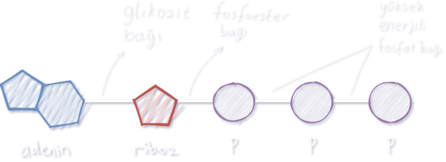
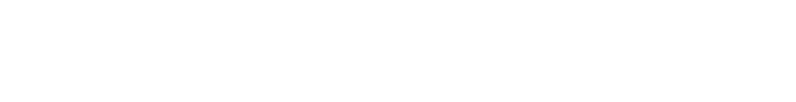
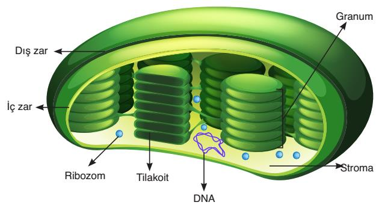
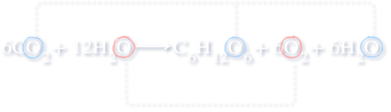
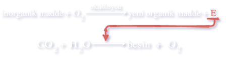
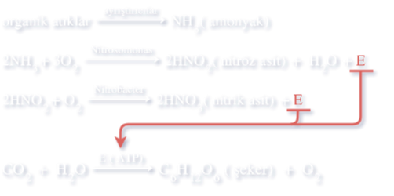
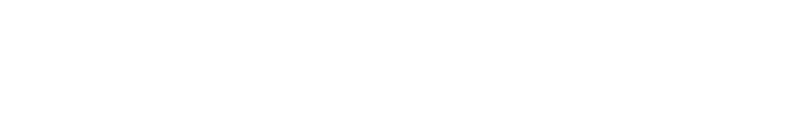
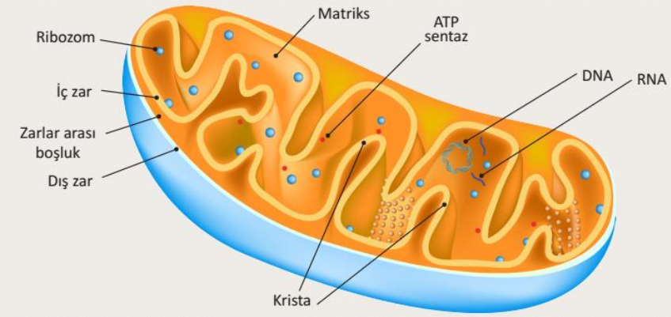

[TOC]

# ATP

* Adenin + riboz = Adenozin   
* Adenin + riboz + fosfat = Adenozin monofosfat

| Terim | Tanım                                                        |
| ----- | ------------------------------------------------------------ |
| `ATP` | Canlıların solunum hücresel solunumla besinlerden elde ettiği enerjiyi yapısında kimyasal bağ enerjisi olarak tutan molekül |
| `ETS` | ➼ Yüksek enerjili elektronları alıp redoks tepkimeleri gerçekleştiren molekül sistemi ➼ Granumda bulunur |

- Canlılar solunumla elde ettikleri enerjiyi ATP'nin fosfatları arasındaki bağ enerjisi olarak tutar.
- ATP anlık olarak üretilir ve tüketilir; depolanmaz veya hücreler arasında aktarılmaz.

- Enerji çıkan = **ekzergonik** (solunum, fermantasyon)
- Enerji isteyen = **endergonik** (aktif taşıma, sinirsel iletim, hareket, sentez)
- Enerji dönüşüm / tüketiminde ısı açığa çıkar. 

## Fosforilasyon çeşitleri

| Ad                   | Tanım                                                        |
| -------------------- | ------------------------------------------------------------ |
| `Substrat düzeyinde` | ➼ Besinlerin monomerlerine ayrılması sırasında substratlardan ayrılan fosfatların ADP molekülüne bağlanması ile ➼ Hem O~2~'li hem O~2~'siz hem de fermantasyonda gözlenir |
| `Oksidatif`          | ➼ Besinlerin monomerlerine ayrılması sırasında ortaya çıkan, NAD ve FAD molekülleri ile taşınan H atomlarındaki enerjiden ETS aracılığıyla ATP sentezi ➼ Ökaryotlarda **mitokondri**, prokaryotlarda **mezozomda** |
| `Fotofosforilasyon`  | Klorofil bulunduran hücrelerde ışık yardımıyla serbest kalan yüksek enerjili etektronlardan ETS ile kademeli ATP sentezi |

# Fotosentez

| Terim        | Tanım                                                        |
| ------------ | ------------------------------------------------------------ |
| `Fotosentez` | ➼ Klorofil taşıyan canlların ışık yardımıyla inorganik maddelerden organik madde sentezlemesi |
| `Ototrof`    | ➼ Kendi besinini kendi sentezleyen canlılar ➼ Işık kullanıyorsa **fotoototrof** |
| `Heterotrof` | Besinini dışarıdan alan canlılar                             |

## Bilim adamları

| Ad                              | Yaptıkları                                                   |
| ------------------------------- | ------------------------------------------------------------ |
| `Joseph Priestley`              | ➼ Oksijen ➼ Oksijen solunum/yanma için lazım ➼ Bitki havayı temizler ➼ Fanus/bitki/mum deneyi |
| `Theodore De Saussure`          | ➼ CO~2~ ve O~2~ oranı ➼ Bitkilerin azot kaynağı topraktaki suda çözülmüş tuzlar |
| `Cournelius Bernardus Van Niel` | ➼ Glikozdaki hidrojenin kaynağı su ➼ Şeker oluşumu süreci |
| `Robert Hill`                   | ➼ Havaya verilen O~2~'nin kaynağı su                         |
| `Melvin Calvin`                 | ➼ Karbon metabolizması                                       |

## Kloroplast yapısı

| Terim      | Tanım                                                        |
| ---------- | ------------------------------------------------------------ |
| `Klorofil` | ➼ Işık enerjisini emer, yapısındaki elektronlar ile ışık enerjisini ETS elemanlarına aktarır ve ışık enerjisinin kimyasal enerjiye dönüşümünü sağlar ➼ Sentezinde görev alan enzimin yapısına kofaktör olarak Fe katılır. Bu nedenle demir açısından fakir topraklarda yetişen bitkilerin fotosentez hızları ve gelişimleri yavaş olur |
| `Stroma`   | ➼ Kloroplastın temel maddesidir ➼ İç zar tarafından çevrelenir ➼ DNA, RNA, fotosentez enzimleri, nişasta, aminoasit, lipit bulundurur |
| `Tilakoit` | ➼ Stroma içinde bulunan üçüncü zar sistemi ➼ Tilakoit zarla çevrilidir ➼ Klorofil burada bulunur |
| `Granum`   | Tilakoitlerin üst üste gelip sütünlaşarak oluşturduğu yapı   |
| `Grana`    | Granumların ara lamelle birbirine tutunarak oluşturduğu yapı |

- Karbonhidrat + lipit + protein + DNA + RNA + klorofil
- Dışında çift katlı seçici geçirgen zar bulunur.
- Metabolik işlevleri için gerekli proteinleri kendi üretebilir.
- Kendini eşleyebilir.

#### Görevleri

1. Granalarındaki klorofil pigmenti ile ışık enerjisini kimyasal enerjiye dönüştürür.
2. Üretilen glikozları geçici olarak depolar.

## Fotosentez denklemi

İlk olarak bitki / siyanobakteri / alg fotosentez tepkimelerinde ortama O~2~ verilirken kükürt bakterisi fotosentez tepkimelerinde ortama S~2~ verildiği gözlenerek kanıtlanmıştır.

Daha sonra ağır oksijen atomları ile işaretleme yapılarak kanıtlanmıştır.

## Işık

| Terim        | Tanım                                                        |
| ------------ | ------------------------------------------------------------ |
| `Pigment`    | ➼ Işığı emen ve renk veren maddeler                          |
| `Karetenoit` | ➼ Plastitlerin içinde bulunan; sarı, turuncu ve kırmızı renk veren pigmentler ➼ Klorofilden farklı dalga boyları soğurup toplam soğurulan enerji miktarını artırır ➼ Klorofilin zarar görmesini engeller ➼ Sarı = ksantofil     Kırmızı = likopen     Turuncu = karoten |

- Yaşam için önemli görülen dalga boyları 380nm - 750nm (görünür ışık) arasıdır
  - Bu aralıkta fotosentez gerçekleşir
- Dalga boyu ($\lambda$), enerji ile ters orantılıdır. 
- En az emilen renk yeşil
  - Yeşil görünmesinin nedeni
- En çok emilen renkler mor ve kırmızı
- Fotosentez hızı - görünür ışık spektrumu ilişkisi Theodore Engelmann tarafından

## Fotosentez reaksiyonları

| Terim              | Tanım                                                        |
| ------------------ | ------------------------------------------------------------ |
| `Fotoliz`          | ➼ Klorofil tarafından soğurulan ışığın bir kısmı ile su moleküllerinin parçalanması |
| NADP^+^            | ➼ Koenzim ➼ Nikotinamid adenin dinükleotit fosfat       |
| CO~2~ `tutucuları` | ➼ CO~2~ ile tepkimeye girip özel tuzları oluşturan bileşikler ➼ NAOH, Ca(OH)~2~, Ba(OH)~2~, KOH |

### Işığa bağımlı

- Ökaryotlarda grana
  Prokaryotlarda mezozom

1. Su fotoliz ile parçalanır.
2. Suyun parçalanması ile açığa çıkan H^+^ atomları NADP^+^ (koenzim) tarafından tutulur, NADPH üretilir. (Hill reaksiyonu)
3. Açığa çıkan oksijenin fazlası atmosfere verilir.
4. Işık tarafından uyarılan elektronlar klorofili terkederek ETS'ye gelir.
5. ETS'de elektronlar elemandan elemana aktarılır, elektronlardaki enerji proton derişimi farkı oluşmasını sağlar ve bu fark ATP sentaz tarafından ATP üretmek için kullanılır. (elektronlardaki enerjinin bir kısmı ısı olarak kaybedilir)
6. Üretilen NADPH ve ATP ışıktan bağımsız reaksiyonlara aktarılır.

### Işıktan bağımsız

- Ökaryotlarda stroma
  Prokaryotlarda sitoplazma
- Kalvin döngüsü (Melvin Kalvin)
- Klorofil ve ETS görev almaz
- Yüksek sıcaklık enzimlerin yapısına zarar verdiğinden fotosentezi yavaşlatır.

1. Foto 1'den gelen ATP + CO~2~ + NADPH = PGAL (Fosfogilseraldehit; 3C)
2. PGAL'in bir kısmı glikoza dönüştürülür, kalanı ilke diğer organik maddelerden sentezlenir.
3. Açığa çıkan NADP^+^ ve ADPler yeniden kullanılmak üzere tekrar granaya

#### Organik molekül sentezleri

1. Glikoz
   - Solunum
   - Nişasta (hücreye enerji sağlamak ve karbon iskeletini oluşturmak için monomerlerine ayrılır) (polisakkarit)
   - Sükroz (fazlası büyüyen veya besin üretilmeyen kısımlara) (disakkarit)
2. Yağ asidi ve gliserol
3. Azotlu organik baz
4. Aminoasit
5. Vitamin

- Son üçü için azot lazım. Bu azot topraktan suda çözünmüş halde (NO~3~^-^ ve NH~4~^+^) alınır. Bu tuzlar yapraklarda fotosentez sırasında CO~2~ özümlemesinde kullanılır.

## Fotosentez hızı

| Terim              | Tanım                                                        |
| ------------------ | ------------------------------------------------------------ |
| `Minimum kuralı`   | Fotosentez hızını etkileyen faktörlerden en düşüğü fotosentez hızını belirler |
| `Optimum sıcaklık` | Enzimlerin görevlerini en iyi yaptığı sıcaklık               |

1. Klorofil sayısı arttıkça hız artar (geniş yapraklı bitkiler daha hızlı fotosentez yapar)
2. Işık şiddeti arttıkça bir yere kadar hız artar sonra sabit devam eder
3. Yeşil dalga boylu ışıkta en yavaş, kırmızı - mor dalga boylu ışıklarda en hızlı
4. CO₂ yoğunluğu arttıkça bir yere kadar hız artar sonra sabit devam eder (CO₂ tutucularının varlığı hızı azaltır.)
5. Yüksek ışık şiddeti altında sıcaklıktaki optimum sıcaklığa kadar olan artışlar fotosentez hızında belirgin bir artışa sebep olur. Düşük ışık şiddetinde bu artışlar belirgin değildir. (Çok yüksek sıcaklıklarda enzimler denatürasyon geçirdiğinden fotosentez durur.)

## Yapay ışıklandırma faydaları

1. Bitki gelişimini artırmak

2. Yetiştirme mevsimini uzatmak

# Kemosentez

| Terim        | Tanım                                                        |
| ------------ | ------------------------------------------------------------ |
| `Kemosentez` | İnorganik maddelerin oksidasyonu ile açığa çıkan enerji kullanılarak CO~2~ ve H~2~O'dan besin üretilmesi |

- Oksitlenen maddelere örnekler: H~2~S, Fe, H~2~, NO~2~^-^ (nitrit), NH~3~ 
- Sadece prokaryotlarda görülür (azot, hidrojen, demir, kükürt bakterileri ve çoğu arke)
- H~2~S kemosentetik canlılar tarafından enerji kaynağı olarak kullanılırken fotosentetik canlılar tarafından  hidrojen ve elektron kaynağı olarak kullanılır.
- Kemosentetik arkelerin çoğu zor koşullarda (düşük O~2~, yüksek sıcaklık, yüksek tuz oranı, yüksek / düşük pH) yaşar.

## Kemosentezin madde döngüsüne katkısı

Bitkilerin azot kullanabilmesini sağlarlar

1. Atmosferdeki N bazı bakteri ve arkeler tarafından tutulur.
2. Ölü bitki ve hayvanların yapısındaki azotlu bileşikler ayrıştırıcılar tarafından NH~3~'a dönüştürülür. Sonra _nitrosomonas_ ve _nitrobacter_ ile nitröz aside ve nitrik aside dönüştürülür. Bunlar suda çözündüğünde bitkiler tarafından kullanılabilir hale gelir.

3. Her iki tür de bu tepkimelerde açığa çıkan enerji ile besin sentezler.

## Kemosentetik canlıların faydaları

1. Doğadaki biyolojik dengenin korunması
2. Ortamlardaki atık maddelerin parçalanması
3. Kemosentetik arkelerin zor koşullara dayanıklı enzimleri ile
   - Metallerin etkisiyle kirlenmiş suların temizlenmesi
   - Boya endüstrisi / arıtma tesislerinde atık su temizliği
   - Kalitesi düşük metal cevherlerinin zenginleştirilmesi

# Fotosentez ve Kemosentezin Ortak Noktaları

1. İnorganikten organik
2. O~2~'siz de olur.
3. O~2~ üretilir
4. Karbon CO~2~'den
5. ATP sentezi
6. Enzimatik
7. ETS kullanılır

# Fotosentez ve Kemosentezin Farkları

| Fotosentez                          | Kemosentez                 |
| ----------------------------------- | -------------------------- |
| Klorofil lazım                      | Klorofil lazım değil       |
| Hem prokaryotlarda hem ökaryotlarda | Sadece prokaryotlarda      |
| Işık enerjisi kullanılır            | Kimyasal enerji kullanılır |
| H^+^ kaynağı H~2~S, H~2~O, H~2~     | H^+^ kaynağı H~2~O         |
| Gündüz                              | Gece - gündüz              |
| O~2~ atmosfere verilir              | O~2~ yapıya katılır        |

# Hücresel Solunum

| Terim              | Tanım                                                        |
| ------------------ | ------------------------------------------------------------ |
| `Hücresel solunum` | Organik moleküllerin yapısındaki kimyasal bağ enerjisi ile ATP sentezi |

## O~2~'li

- Ökaryotlarda mitokondri + sitoplazma
  Prokaryotlarda mezozom + sitoplazma
- Besin moleküllerinin oksijen kullanılarak yıkılması sırasında açığa çıkan enerji  ile ATP sentezlenmesi
- Enzim kontrolünde gerçekleştiği için sıcaklıktan etkilenir
- Fermantasyona göre daha fazla ATP sentezlenir
- 1 glikozdan NADH elektronlarını hangi hangi molekülün aldığına göre 30-32 ATP sentezlenir (4'ü substrat düzeyinde fosforilasyon ile)
- Pirüvik asit inorganik maddelere kadar parçalandığı için diğer solunum çeşitlerine göre daha fazla ATP üretilir.

###  Mitokondri

| Terim     | Tanım                                                        |
| --------- | ------------------------------------------------------------ |
| `Krista`  | İç zar kıvrımları                                            |
| `Matriks` | ➼ İç zar içindeki sıvı ➼ Mitokondrial DNA, RNA, ribozom burada |

1. Dıştaki düz içteki girintili çıkıntılı (solunum yüzeyini  artırmak için) olmak üzere çift birim zar
2. Protein sentezleyebilir
3. Kendini eşleyebilir
4. O~2~'li solunumda yer alan enzimler krista ve matrikste
5. Sayısı hücre yapısı / enerji  ihtiyacına göre değişir

### Evreler

#### 1. Glikoliz

- Sitoplazmada gerçekleşir
- Glikozun pirüvik aside kadar parçalandığı sırada bir miktar ATP'nin üretildiği enzimsel tepkime dizisi
- Glikoliz sırasında ara ürünlerden ayrılan elektron ve hidrojenler NADH olarak kristaya aktarılır

1. Glikozu kararsızlaştırmak için 2 ATP kullanılır
2. Glikoz (6C), 2 tane pirüvik aside (3C) dönüştürülür
3. 4 ATP üretilir.
4. NAD'lar hidrojen alarak alarak NADH oluşturur

#### 2. Pirüvik Asitten Asetil-CoA

- Ortamda yeterli O~2~ varsa pirüvik asitlerin matrikse girip CO~2~ çıkışı ve  NADH oluşumu ile asetil-CoA'ya dönüşmesi
- Eğer yeterli O~2~ yoksa pirüvik asitler etil alkol ve laktik asit fermantasyonuna katılır (mitokondriye geçemez)
- Hücre içerisinde yeterli oksijen olup olmadığını gösteren en önemli ölçüt

#### 3. Krebs

- Hans Krebs tarafından
- Bir glikoz için 2 krebs
- Organik yapılı fakat farklı karbon sayısına sahip moleküllerden ayrılan proton (H^+^) ve elektronlar 6NAD^+^ ve 2FAD^+^ (flavin adenin dinükleotit) tarafından tutulur. (4CO~2~ + 6NADH + 2FADH~2~ oluşur, son ikisi ETS'ye aktarılır.)
- 1 glikozdan 2 ATP sentezlenir

1. Asetil-CoA (2C) + 4C'lu organik asit = Sitrik asit (6C)
2. Peşpeşe reaksiyonlar ile sitrik asitten tekrar 4C'lu organik madde
3. ATP sentezlenir

#### 4. ETS - Oksidatif

1. ETS molekülleri NADH ve FADH~2~ ile gelen yüksek enerjili eletronları tutar
2. Elektronlar redoks tepkimeleri ile oksijene kadar taşınır
3. Elektron kazanmış oksijen elektron kaybetmiş bir çift proton ile birleşerek H~2~O oluşturur.
4. NADH'dan gelen elektronları kimin aldığına göre 26-28 ATP sentezlenir

## O~2~'siz

| Terim             | Tanım                                                        |
| ----------------- | ------------------------------------------------------------ |
| `Denitrifikasyon` | ➼ NO~3~^-^ 'nun oksijensiz solunum yapan bakteriler tarafından N~2~'ye dönüştürülmesi ve bu bakterilerin  SOE olarak kullandığı NO~3~'ünelektron alarak birkaç aşamada N~2~'ye dönüşmesi ➼ Azot döngüsünün korunmasını sağlar |

- Besin moleküllerinin O~2~ kullanmadan yıkılması sırasında koparıla elektronların ETS üzerinden son elektron taşıyıcısına (SOE) aktarılırken açığa çıkan enerji ile ATP sentezi
- SOE genelde O~2~ değil, elektron çekim gücü az > daha az ATP üretilmesine neden olur
- SOE örnekleri: SO~4~^2-^, NO~3~^-^, S, CO~2~, Fe^3+^

### Fermantasyon

- Oksijen kullanılmadan sadece glikoz ile ATP sentezi
- Glikoliz (enzim aynı) sonucu oluşan pirüvik asit, etil alkol veya laktik asite (enzim farklı) dönüştürülür
- Glikoliz + son ürün evreleri (mayalanma)

#### Faydaları

1. Ekmek, yoğurt, sirke, boza, şalgam, kefir üretimi
2. Besinlerin bozulmadan saklanması
3. Probiyotik açısından zengin ürünler

#### 1. Etil Alkol Fermantasyonu

- Glikoliz sonrası son ürün evresinde CO~2~ çıkışı ve NADH yapısındaki hidrojenlerin tepkimeye katılması ile ortaya 2 etil alkolün çıktığı fermantasyon
- 2 ATP üretilir
- Mayalar ve bakteriler için son ürün evresinde açığa çıkan etil alkol, belirli bir değerin üstünde zehir etkisi yaptığı için etil alkol sonucu oluşan ürünlerin alkol seviyeleri çok yüksek değildir.

#### 2. Laktik Asit Fermantasyonu

- Glikolizde sonrası NADH yapısındaki hidrojenlerin tepkimeye katılması ile ortaya 2 laktik asidin çıktığı fermantasyon
- CO~2~ çıkışı yok
- 2 ATP üretilir
- Bazı bakterilerde görülür.
- Alyuvarlarda çekirdek ve organel olmadığı için laktik asit fermantasyonu yapar

##### Çizgili kas hücrelerinde

- Çizgili kas hücreleri yoğun kas egzersizleri veya kas gücü gerektiren işlerin başında yeterli O~2~ sağlanamazsa (O~2~'li solunum durmaz) laktik asit fermantasyonu yapar
- Ani kramplar görülebilir
- Üretilen az miktardaki laktik asit, yeterli oksijen sağlandığında kasların daha iyi çalışmasını sağlar
- Kas aktivitesi artarsa laktik asit de artar ve kaslarda birikir
  1. Biriken laktik asit kan damarları ile beyne gelir; uyku, ağrı, yorgunluk merkezleri uyarılır)
  2. Dinlenmede yeterli O~2~ sağlanırsa biriken laktik asit karaciğere taşınır. Burada özel biyokimyasal tepkimelerle laktik asit pirüvik asit + glikoz'a dönüştürülür.
     - Pirüvik asit O~2~'li solunumda tüketilir.
     - Glikozların fazlası glikojen olarak depolanır.

# Fotosentez Solunum İlişkisi

- Oksijenli solunumun son ürünleri CO~2~ ve H~2~O fotosentezde kullanılır
- Fotosentezin son ürünleri besin ve oksijen O~2~'lide kullanılır
- O~2~'liler tarafından verilen CO~2~ fotosentetikler tarafından kullanılır ve CO~2~ dengesi korunur
